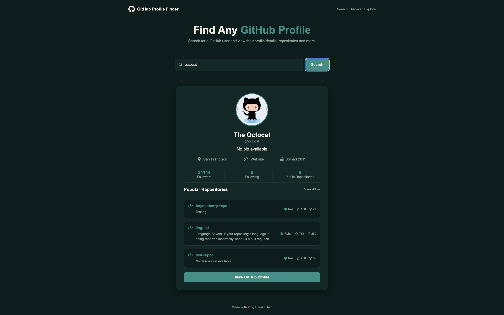

# GitHub Profile Finder

A simple and modern GitHub Profile Finder built with Vanilla JavaScript. Search for any GitHub username and view their profile information, statistics, and popular repositories using the GitHub REST API.

## 🚀 Features

- 🔍 Search GitHub users by username
- ⌨️ Search using the Enter key
- 👤 Display profile avatar, name, username and bio
- 📍 Show location and personal website
- 📅 Display GitHub account creation year
- 👥 Show followers and following
- 📦 Show total public repositories
- ⭐ Display popular repositories
- 💻 Show repository language, stars and forks
- 🔗 Open individual repositories directly
- 🌐 Open the complete GitHub profile
- ⚠️ Basic error handling for invalid users and API requests
- 📱 Responsive dark-themed UI

## 🛠️ Tech Stack

- HTML5
- CSS3
- JavaScript
- GitHub REST API
- Font Awesome

## 📸 Preview



## 🔗 API Used

This project uses the GitHub REST API to retrieve user and repository information.

### User Profile

```text
GET https://api.github.com/users/{username}
```

### User Repositories

```text
GET https://api.github.com/users/{username}/repos
```

The repository request is sorted by stars and limited to the top 3 repositories.

## 📂 Project Structure

```text
github-profile-finder/
│
├── index.html
├── style.css
├── script.js
└── README.md
```

## ⚙️ How to Run

1. Clone the repository:

```bash
git clone https://github.com/PiyushJain-cmd/github-profile-finder.git
```

2. Open the project folder:

```bash
cd github-profile-finder
```

3. Open `index.html` in your browser.

No build tools or dependencies are required.

## 🎯 How It Works

1. Enter a GitHub username.
2. Click **Search** or press **Enter**.
3. The application sends a request to the GitHub REST API.
4. The user's profile information is displayed.
5. A second API request retrieves their repositories.
6. The three most-starred repositories are displayed on the profile card.

## 🎨 Design

The interface uses a dark teal color palette with:

- Minimal and clean layout
- Rounded profile card
- Subtle borders and shadows
- GitHub and Font Awesome icons
- Interactive repository cards
- Hover effects
- Responsive layout

## 📚 What I Learned

Building this project helped me practice and understand:

- DOM manipulation
- Selecting and updating HTML elements with JavaScript
- Event listeners
- Handling button clicks and keyboard events
- `fetch()` API
- `async/await`
- Promises
- JSON data handling
- HTTP response handling
- HTTP status codes such as `200` and `403`
- Checking `response.ok`
- API rate limits
- Working with API endpoints
- Using request headers
- Array `map()`
- Template literals
- Dynamic HTML generation
- Conditional rendering with `||`
- Error handling with `try...catch`
- Working with nested API data
- Git and GitHub workflow
- Creating commits and pushing projects to GitHub
- GitHub secret scanning and push protection

## 🔮 Future Improvements

Possible future additions:

- Repository pagination
- Search history
- GitHub organization information
- Followers/following lists
- Dark/light theme toggle
- Repository filtering
- More detailed repository information
- Better mobile optimization

## 👨‍💻 Author

**Piyush Jain**

Built as a Vanilla JavaScript project to practice working with APIs, asynchronous JavaScript, DOM manipulation, and dynamic web interfaces.

---

⭐ If you found this project interesting, consider giving it a star!
